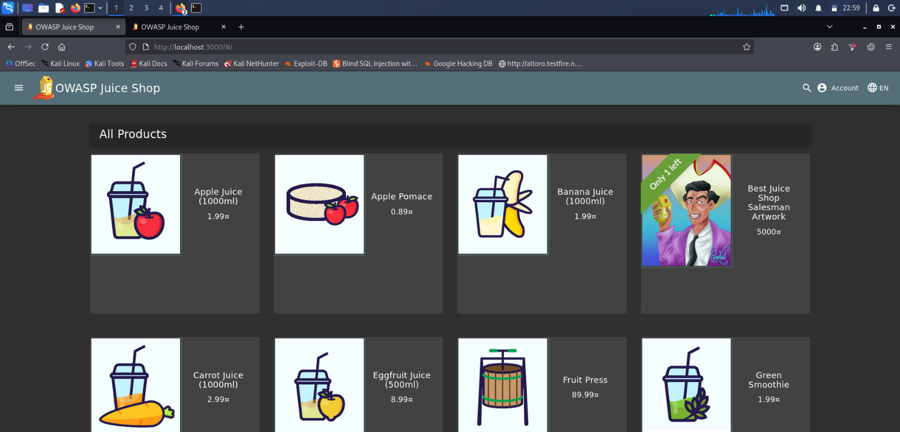
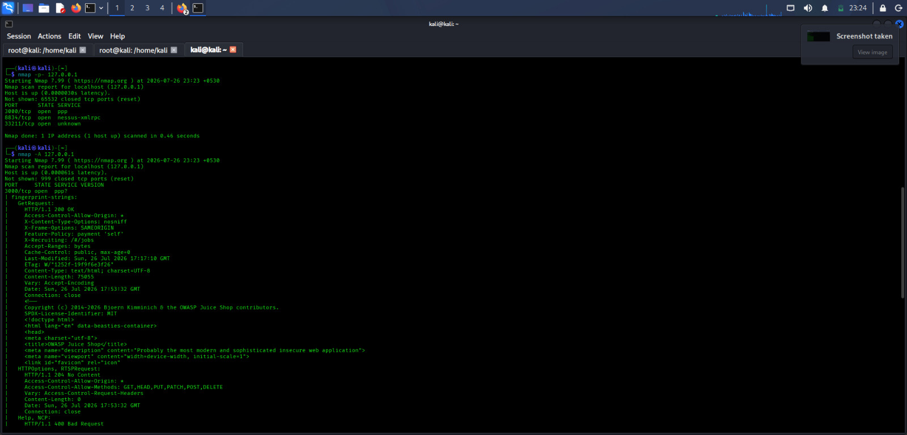
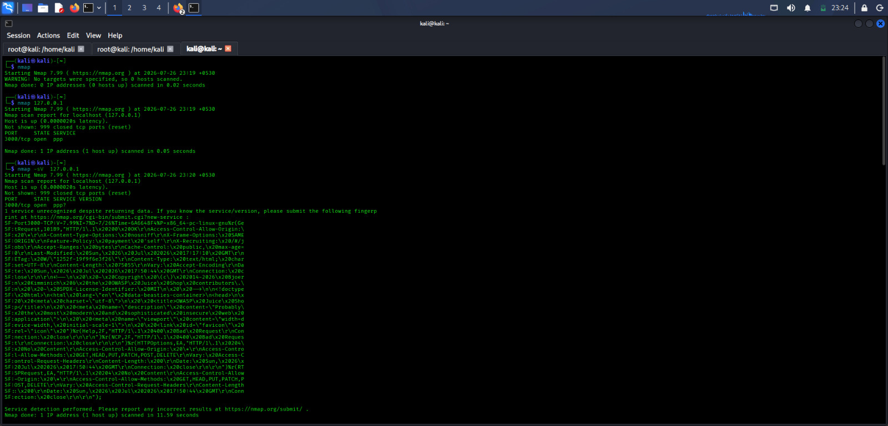
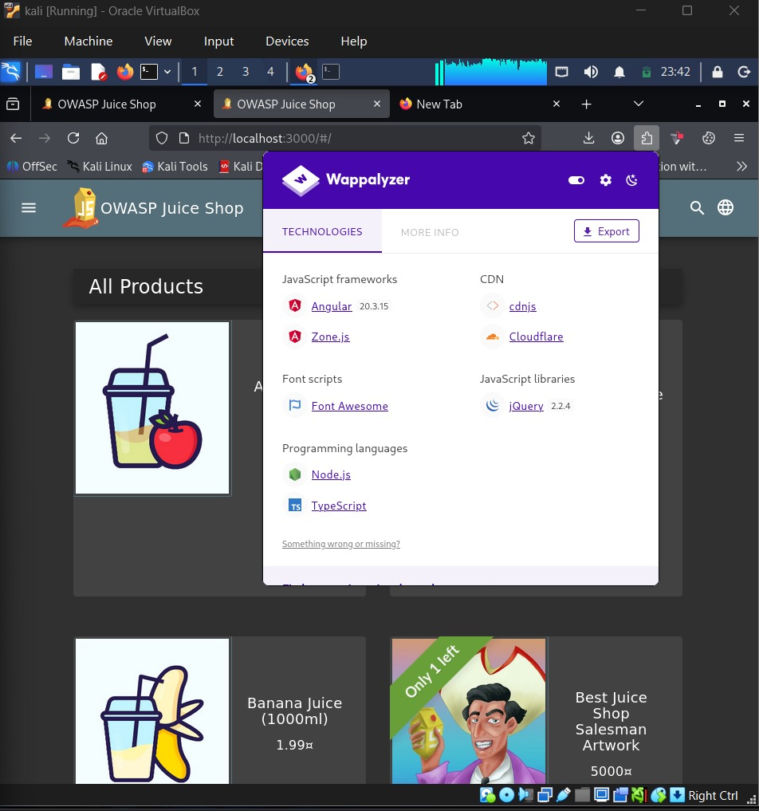
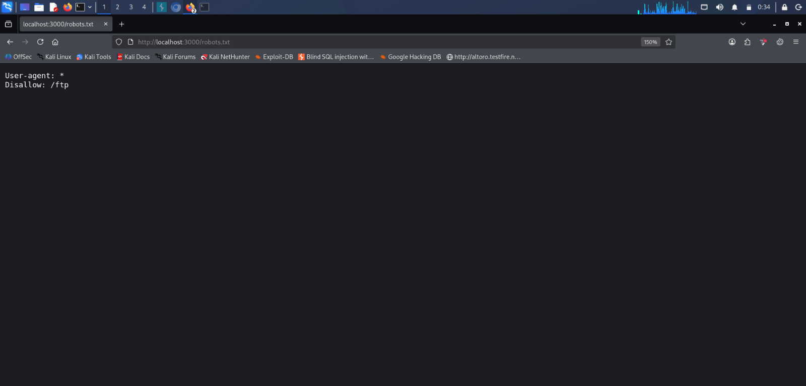
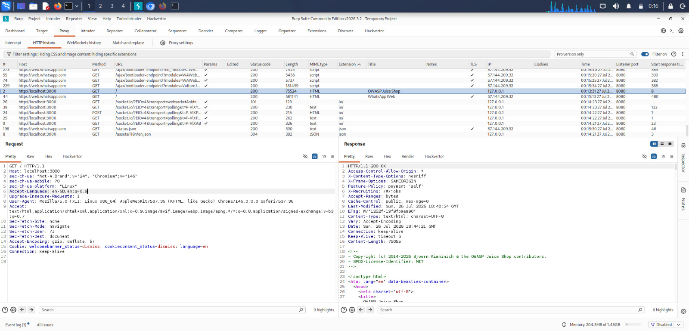
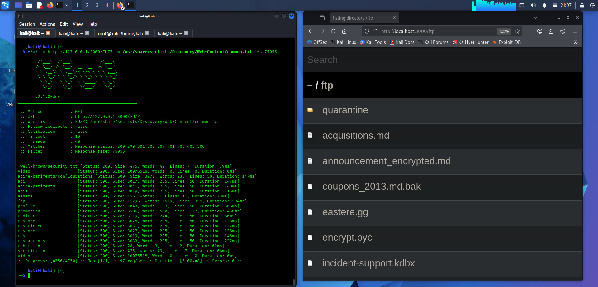
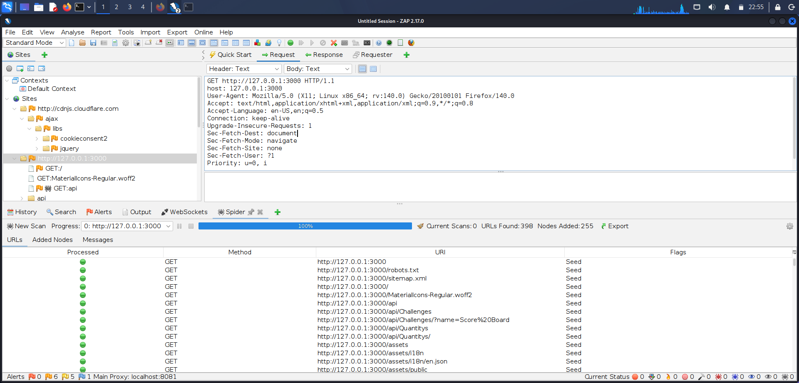
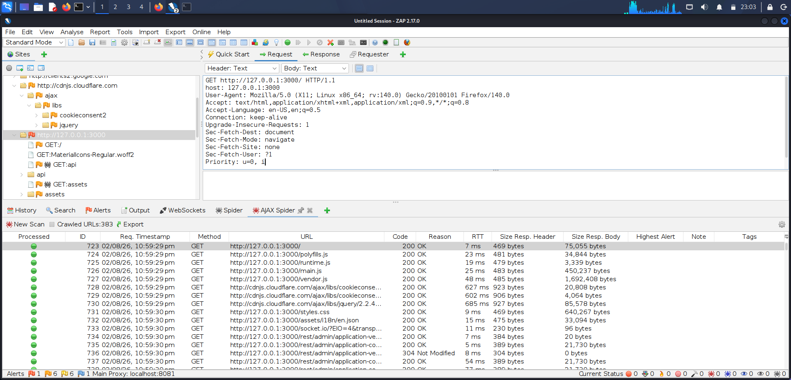

# Phase 1 – Information Gathering

## Overview

This phase focuses on gathering information about the OWASP Juice Shop application before performing vulnerability testing.

The objective was to identify the target, exposed ports and services, technologies used by the application, HTTP communication, accessible files and directories, and application endpoints.

---

## Target Information

| Item | Details |
|---|---|
| Target Application | OWASP Juice Shop |
| Target URL | `http://127.0.0.1:3000` |
| Environment | Local Lab |
| Testing Type | Web Application VAPT |

---

## Tools Used

| Tool | Purpose |
|---|---|
| Browser | Manual application exploration |
| Nmap | Port and service discovery |
| Wappalyzer | Technology identification |
| Burp Suite | HTTP request and response analysis |
| OWASP ZAP | Spidering and crawling |
| ffuf | Directory and endpoint discovery |

---

# Information Gathering Results

## 1. Target Application Identification

**Objective:**  
Confirm that the OWASP Juice Shop application is running and accessible.

**Target:**

`http://127.0.0.1:3000`

**Result:**  
The OWASP Juice Shop application was successfully accessed in the browser on port `3000`.

**Evidence:**



---

## 2. Port and Service Discovery

**Tool:** Nmap

**Objective:**  
Identify accessible ports and services associated with the target.

**Result:**  
The scan confirmed that the target web application was accessible through port `3000`.

**Evidence:**





---

## 3. Technology Identification

**Tool:** Wappalyzer

**Objective:**  
Identify technologies and frameworks used by the target web application.

**Result:**  
Wappalyzer was used to fingerprint technologies associated with the OWASP Juice Shop application.

**Evidence:**



---

## 4. robots.txt Analysis

**Tool:** Browser

**Objective:**  
Check whether the application exposes a `robots.txt` file and review any paths disclosed through it.

**Result:**  
The application's `robots.txt` file was accessed and reviewed for potentially interesting paths.

**Evidence:**



---

## 5. HTTP Request and Response Analysis

**Tool:** Burp Suite

**Objective:**  
Inspect HTTP communication between the browser and the OWASP Juice Shop application.

**Result:**  
Burp Suite successfully captured application traffic. HTTP requests, responses, headers, cookies, methods, and status codes could be inspected.

A request to the application returned:

`HTTP/1.1 200 OK`

This confirmed successful communication between the client and the target application.

**Evidence:**



---

## 6. Directory and Endpoint Discovery

**Tool:** ffuf

**Objective:**  
Discover accessible directories and endpoints that may not be immediately visible through normal browser navigation.

**Result:**  
ffuf was used against the local OWASP Juice Shop application to enumerate application paths and identify accessible resources.

**Evidence:**



---

## 7. Web Crawling – OWASP ZAP Spider

**Tool:** OWASP ZAP

**Objective:**  
Crawl the application and identify linked resources and endpoints.

**Result:**

The traditional ZAP Spider completed successfully.

- URLs Found: **398**
- Nodes Added: **255**

Multiple application resources and REST endpoints were identified during crawling.

Examples included:

- `/rest/admin/application-configuration`
- `/rest/admin/application-version`
- `/rest/languages`
- `/rest/products`
- `/rest/products/search`
- `/socket.io/`

**Evidence:**



---

## 8. Dynamic Crawling – OWASP ZAP AJAX Spider

**Tool:** OWASP ZAP

**Objective:**  
Perform browser-based crawling to discover dynamically generated application content and routes.

**Result:**

The AJAX Spider crawled **383 URLs**.

The crawl identified application resources, JavaScript files, REST endpoints, and dynamically requested resources.

**Evidence:**



---

# Information Gathering Summary

The Information Gathering phase established an initial understanding of the OWASP Juice Shop attack surface.

The activities performed included:

- Target application identification
- Port and service discovery
- Technology fingerprinting
- `robots.txt` analysis
- HTTP request and response inspection
- Directory and endpoint discovery
- Traditional web crawling
- AJAX-based dynamic crawling

The information and endpoints discovered during this phase will be used as the foundation for subsequent vulnerability assessment and penetration testing phases.

---

## Evidence Structure

```text
images/
├── 01-target-application.png
├── 02-nmap-port-scan.png
├── 03-nmap-service-detection.png
├── 04-wappalyzer-technologies.png
├── 05-robots-txt.png
├── 06-burp-http-request-response.jpeg
├── 07-ffuf-directory-discovery.png
├── 08-zap-spider-results.png
└── 09-zap-ajax-spider-results.png
```

---

## Disclaimer

All testing documented in this project was performed against OWASP Juice Shop in a controlled local lab environment for educational and cybersecurity training purposes.
