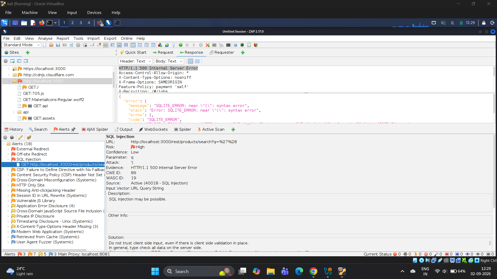
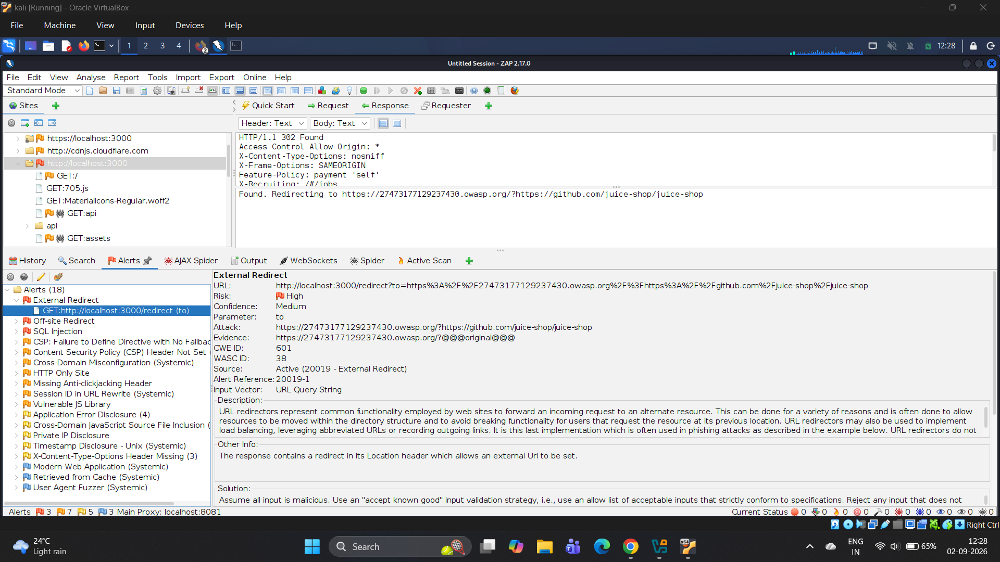

# Phase 3 — Vulnerability Scanning and Assessment

## Overview

Phase 3 focused on identifying potential security weaknesses in the OWASP Juice Shop application through automated vulnerability scanning and security alert analysis.

The primary security scanning tool used during this phase was OWASP ZAP.

The alerts generated during automated scanning were treated as potential vulnerabilities. They were not considered confirmed findings until they were manually verified during Phase 4.

This phase therefore focused on automated detection, alert review, assessment, and selection of issues requiring further manual investigation.

---

## Objectives

The main objectives of Phase 3 were:

- Identify potential security vulnerabilities using automated security scanning.
- Analyze the application for common web application security weaknesses.
- Review security alerts generated by OWASP ZAP.
- Identify issues requiring further manual investigation.
- Select relevant scanner alerts for Phase 4 manual validation.
- Collect supporting scanner evidence.
- Establish an initial understanding of the application's security posture.

---

## Tool Used

| Tool | Purpose |
|---|---|
| OWASP ZAP | Web application crawling, passive scanning, active scanning, and security alert generation |

---

# Scanning Activities

The following OWASP ZAP activities were performed during this phase.

## 1. Spider Scan

The traditional ZAP Spider was used to crawl the application and identify accessible pages, links, and application endpoints.

The Spider scan supported the discovery of application resources that could subsequently be analyzed during vulnerability scanning.

---

## 2. AJAX Spider

The ZAP AJAX Spider was used to perform browser-based crawling of the JavaScript-driven OWASP Juice Shop application.

This helped identify dynamically generated application content, routes, resources, and requests that may not be discovered through traditional crawling alone.

---

## 3. Passive Scan

The passive scanner analyzed HTTP traffic generated during application browsing and crawling.

Passive scanning was performed without actively modifying requests to exploit vulnerabilities.

The resulting alerts were reviewed as potential security issues requiring further investigation.

---

## 4. Active Scan

The ZAP Active Scanner was used against the discovered application attack surface to identify potential vulnerabilities through automated security testing.

The active scan generated security alerts that required review and manual validation before being treated as confirmed vulnerabilities.

---

## 5. Alert Review

The security alerts generated by OWASP ZAP were reviewed to determine which issues required further investigation.

Automated scanner alerts were treated as **potential vulnerabilities** rather than confirmed findings.

A vulnerability was considered confirmed only after appropriate manual testing and proof-of-concept validation during Phase 4.

---

# ZAP Scan Results

The OWASP ZAP assessment generated a total of **18 alerts**.

The alerts were reviewed and relevant issues were selected for additional investigation.

| Scan Result | Count |
|---|---:|
| Total ZAP Alerts | 18 |
| ZAP Alerts Documented with Supporting Evidence | 2 |
| Other Alerts Reviewed | 16 |

The two alerts documented with dedicated scanner evidence were:

1. SQLI-02 — SQL Injection – Product Search Parameter
2. OR — Open Redirect – Unvalidated Redirect Parameter

These alerts were retained as scanner observations and were not treated as confirmed vulnerabilities solely on the basis of the ZAP results.

---

# Findings Selected for Further Investigation

The following ZAP alerts were documented and carried forward for further investigation:

| Finding ID | Vulnerability | Phase 3 Status |
|---|---|---|
| SQLI-02 | SQL Injection – Product Search Parameter | Potential vulnerability identified by ZAP |
| OR | Open Redirect – Unvalidated Redirect Parameter | Potential vulnerability identified by ZAP |

Further manual testing was required to determine whether these alerts were exploitable and to establish their actual security impact.

The manual validation and proof-of-concept activities were performed separately in **Phase 4 — Manual Verification and PoC**.

---

# ZAP Evidence

The following evidence was collected from the OWASP ZAP scanning activities.

## SQLI-02 — SQL Injection

OWASP ZAP generated a possible SQL Injection alert associated with the product search functionality.

**Evidence:**



The evidence demonstrates the scanner-generated alert. It does not, by itself, establish final exploitability.

Manual validation was subsequently performed during Phase 4.

---

## OR — Open Redirect

OWASP ZAP generated an alert associated with a potential Open Redirect condition.

**Evidence:**



The evidence demonstrates the scanner-generated alert.

The issue required manual verification to determine whether the redirect behaviour was actually exploitable.

---

# Phase 3 Assessment Process

The vulnerability assessment followed the following workflow:

```text
Application Crawling
        ↓
Passive Scanning
        ↓
Active Scanning
        ↓
ZAP Alert Generation
        ↓
Alert Review
        ↓
Potential Vulnerability Identification
        ↓
Selection for Manual Validation
        ↓
Phase 4 — Manual Verification and PoC
