# Phase 4 — Manual Verification and Proof of Concept

## Overview

Phase 4 focused on the manual verification and proof-of-concept validation of security vulnerabilities identified during the OWASP Juice Shop assessment.

The purpose of this phase was to verify whether identified security weaknesses were actually exploitable and to confirm their security impact using appropriate testing techniques and supporting evidence.

Automated scanner alerts from Phase 3 were not treated as confirmed vulnerabilities until they were manually validated.

The vulnerabilities confirmed during this phase are documented below.

---

## Objectives

The main objectives of Phase 4 were:

- Manually verify potential vulnerabilities identified during the assessment.
- Confirm the exploitability of identified security weaknesses.
- Validate the security impact of confirmed vulnerabilities.
- Identify vulnerabilities through manual security testing where applicable.
- Collect proof-of-concept evidence.
- Document confirmed security findings.
- Provide supporting evidence for the final VAPT report.

---

# Confirmed Vulnerabilities

The following vulnerabilities were confirmed during the assessment:

| Finding ID | Vulnerability | Severity | Status |
|---|---|---|---|
| BAC | Broken Access Control – Privilege Escalation via Registration | Critical | Confirmed |
| IDOR | Insecure Direct Object Reference – Unauthorized Basket Access | Medium | Confirmed |
| AUTH | Weak Password Recovery | Critical | Confirmed |
| SQLI-01 | SQL Injection – Authentication Bypass | Critical | Confirmed |
| SQLI-02 | SQL Injection – Product Search and Data Extraction | High | Confirmed |
| XSS | Reflected Cross-Site Scripting – Search Parameter | Medium | Confirmed |
| CSRF | Cross-Site Request Forgery – Profile Update | Medium | Confirmed |
| OR | Open Redirect – Unvalidated Redirect Parameter | Medium | Confirmed |

**Total Confirmed Vulnerabilities: 8**

---

# Severity Distribution

The confirmed findings were distributed as follows:

- Critical: 3
- High: 3
- Medium: 2
- Low: 0

---

# Finding Summary

## BAC — Broken Access Control

A Broken Access Control vulnerability was confirmed in the registration functionality.

The vulnerability allowed unauthorized privilege escalation by manipulating role-related information during registration, resulting in access to administrative functionality.

**Severity:** Critical

**CVSS:** 9.8

**OWASP Category:** A01:2021 – Broken Access Control

**Evidence:**

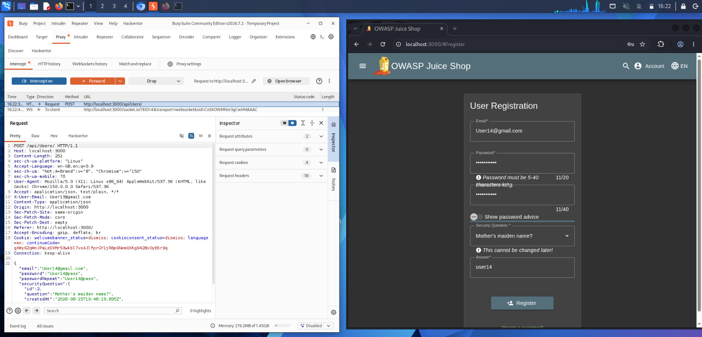

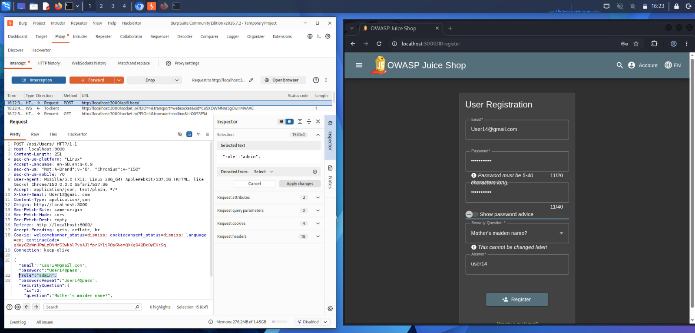

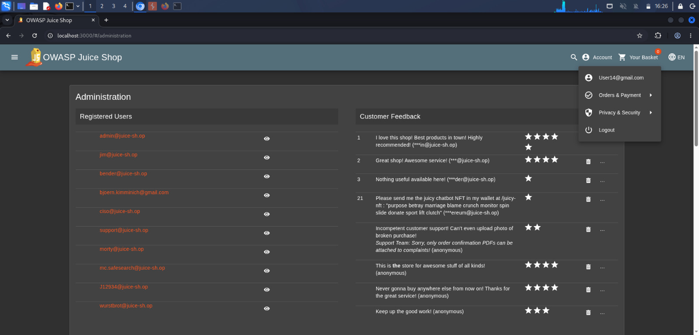

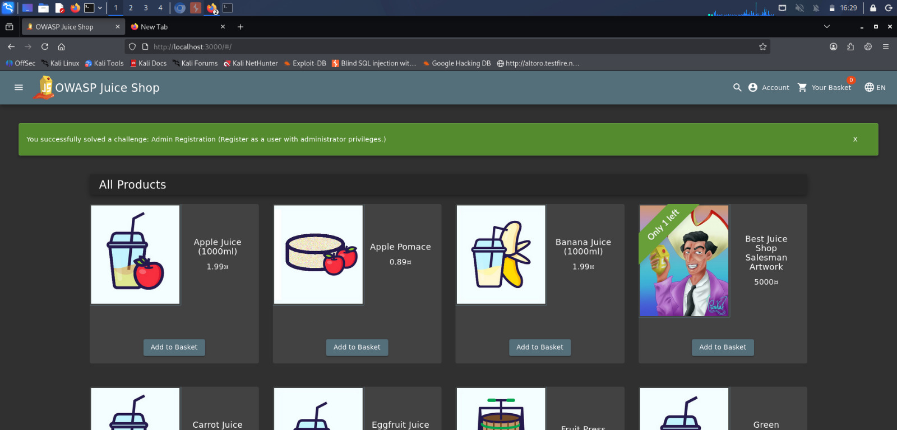

---

## IDOR — Unauthorized Basket Access

An Insecure Direct Object Reference vulnerability was confirmed in the basket functionality.

The vulnerability allowed access to another user's basket by modifying the basket identifier in the request.

**Severity:** Medium

**CVSS:** 6.5

**OWASP Category:** A01:2021 – Broken Access Control

**Evidence:**

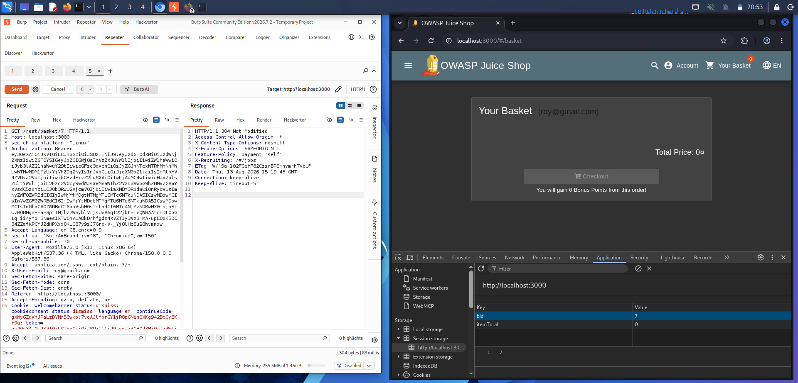

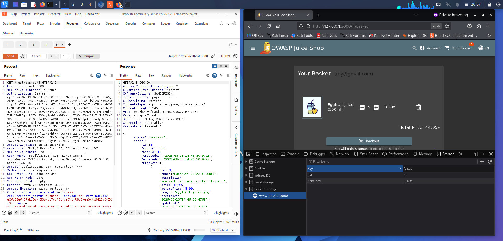

---

## AUTH — Weak Password Recovery

A weakness was identified in the password recovery mechanism involving the security question process.

The weakness could allow unauthorized account takeover without knowledge of the original password.

**Severity:** Critical

**CVSS:** 9.1

**OWASP Category:** A07:2021 – Identification and Authentication Failures

**Evidence:**

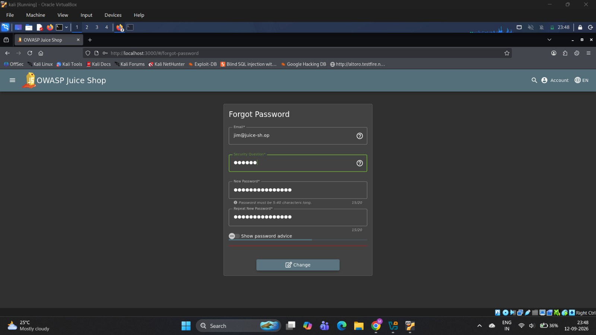

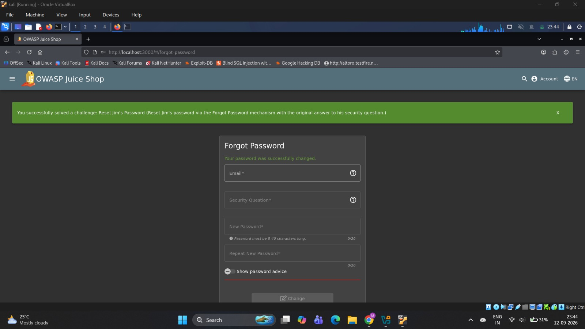

---

## SQLI-01 — SQL Injection Authentication Bypass

A SQL Injection vulnerability was confirmed in the authentication functionality.

The vulnerability allowed authentication controls to be bypassed through malicious input supplied to the login functionality.

**Severity:** Critical

**CVSS:** 9.8

**OWASP Category:** A03:2021 – Injection

**Evidence:**

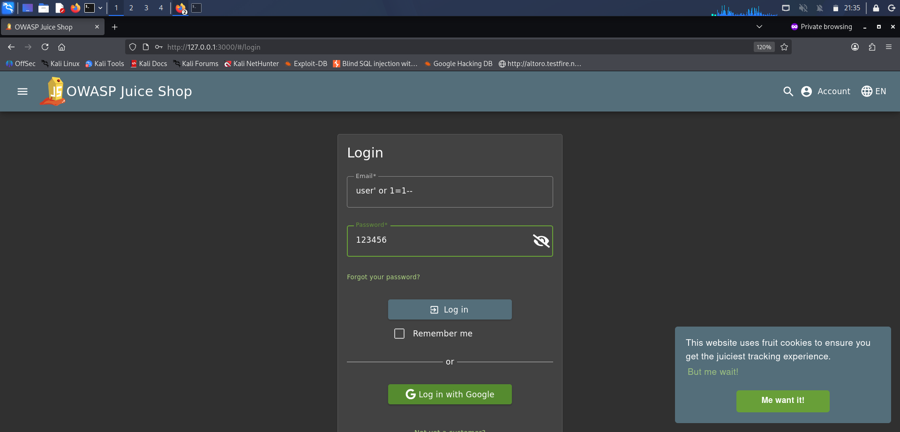

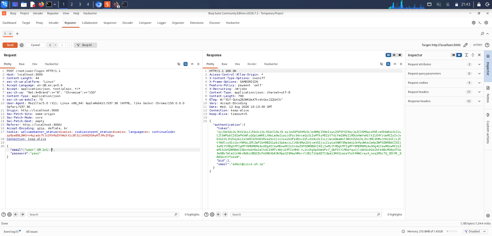

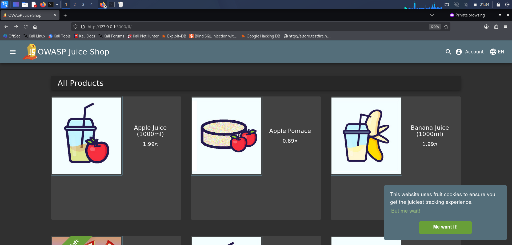

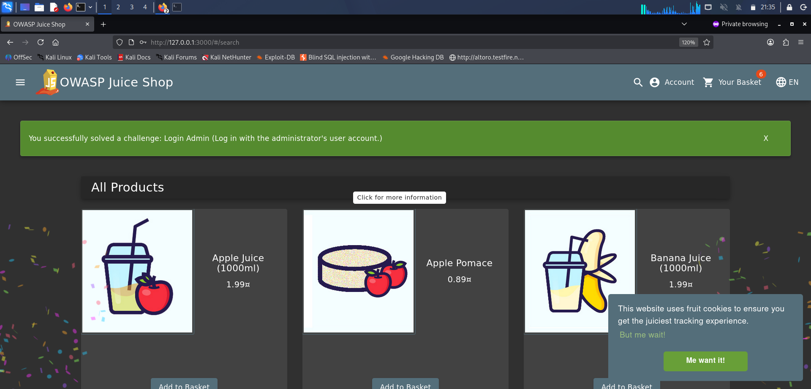

---

## SQLI-02 — SQL Injection Product Search and Data Extraction

A SQL Injection vulnerability was confirmed in the product search functionality.

The vulnerable search parameter allowed database interaction and demonstrated the potential for unauthorized data extraction.

**Severity:** High

**CVSS:** 7.5

**OWASP Category:** A03:2021 – Injection

**Evidence:**

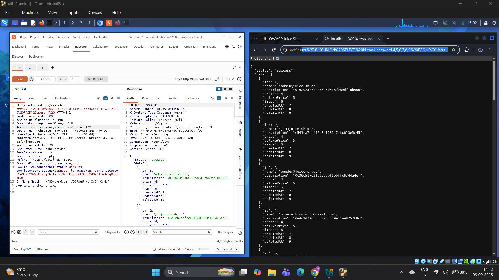

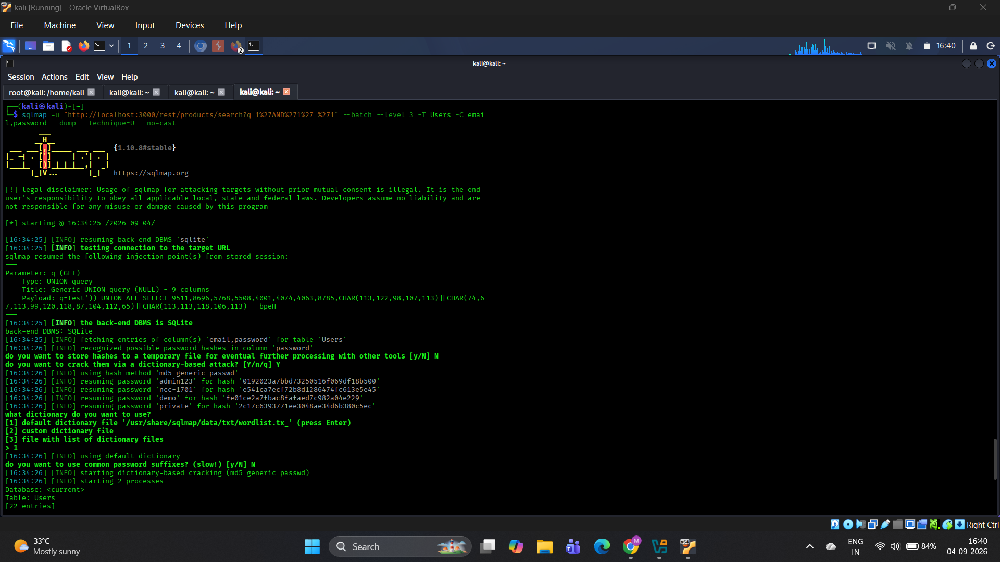

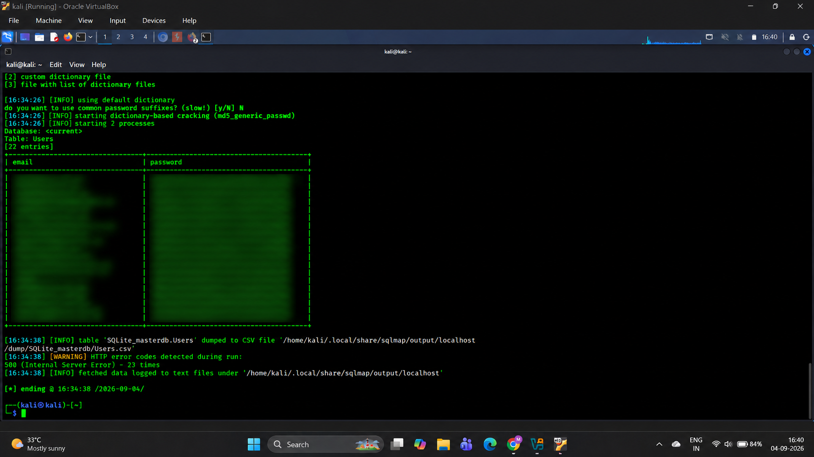

---

## XSS — Reflected Cross-Site Scripting

A Reflected Cross-Site Scripting vulnerability was confirmed in the product search functionality.

The vulnerable input allowed attacker-controlled JavaScript to be reflected and executed in the victim's browser.

**Severity:** Medium

**CVSS:** 6.1

**OWASP Category:** A03:2021 – Injection

**Evidence:**

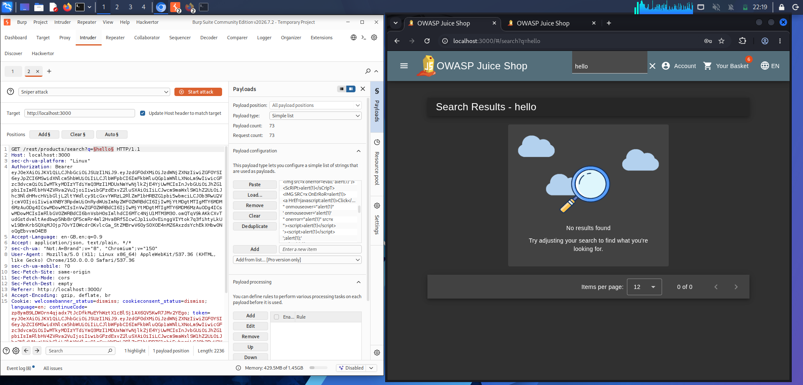

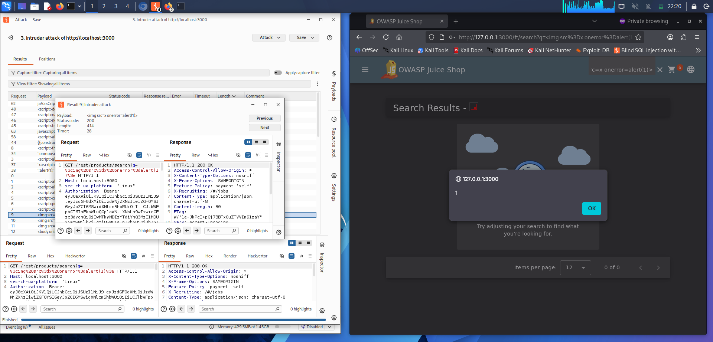

---

## CSRF — Profile Update

A Cross-Site Request Forgery vulnerability was confirmed in the profile update functionality.

The vulnerability could allow an unauthorized profile modification request to be performed using an authenticated user's session.

**Severity:** Medium

**CVSS:** 4.3

**OWASP Category:** A01:2021 – Broken Access Control

**Evidence:**

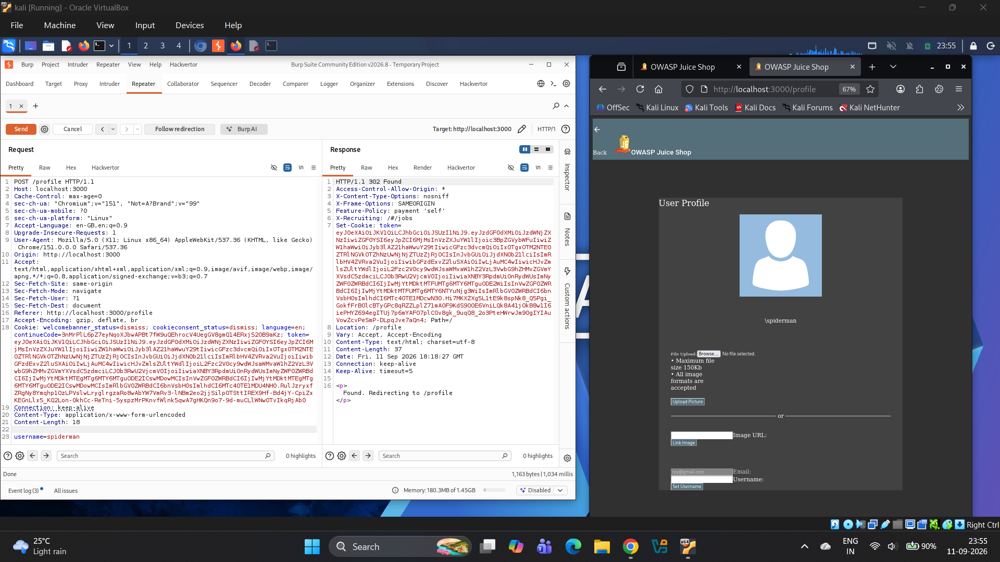


---

## OR — Open Redirect

An Open Redirect vulnerability was confirmed in the application's redirect functionality.

The vulnerable redirect parameter allowed an attacker-controlled external destination to be supplied to the application.

**Severity:** Medium

**CVSS:** 4.3

**OWASP Category:** A01:2021 – Broken Access Control

**Evidence:**


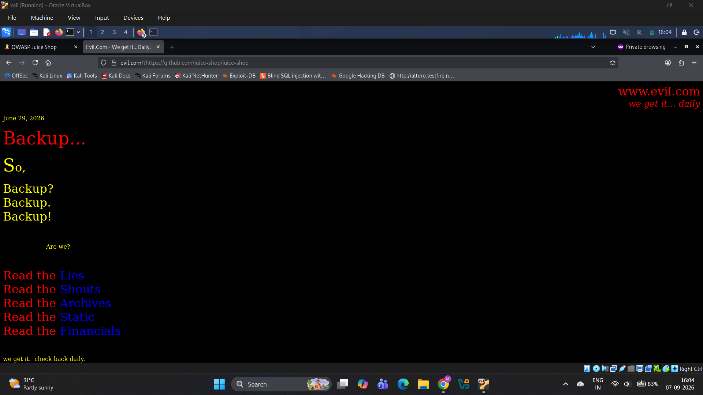

---

# Manual Verification Process

The confirmed vulnerabilities were validated using a combination of manual testing and security testing tools.

The general verification process followed:

```text
Potential Vulnerability
        ↓
Manual Request Analysis
        ↓
Payload / Parameter Manipulation
        ↓
Application Response Analysis
        ↓
Exploitability Verification
        ↓
Impact Demonstration
        ↓
Evidence Collection
        ↓
Confirmed Finding
